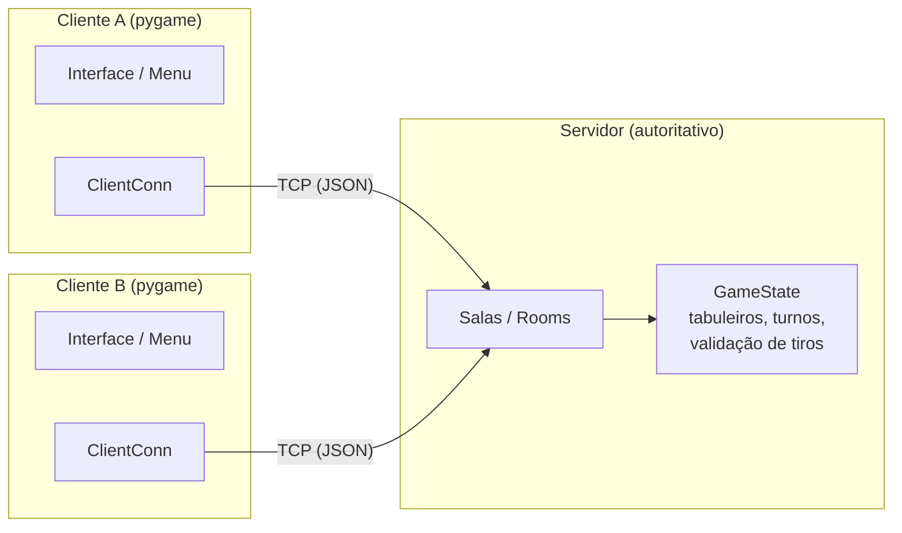
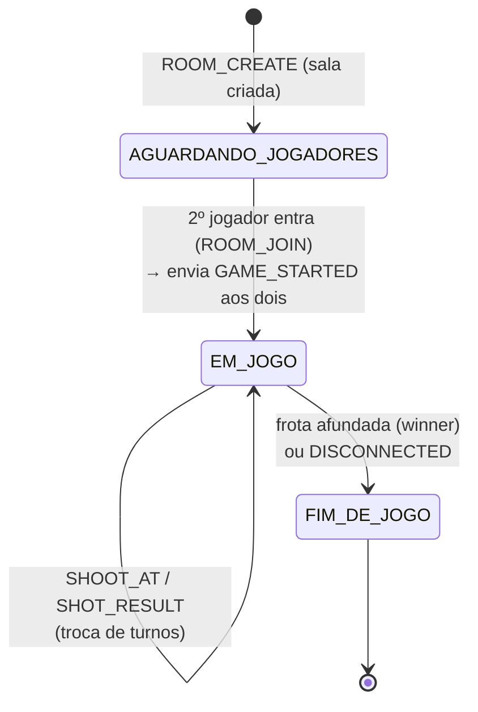
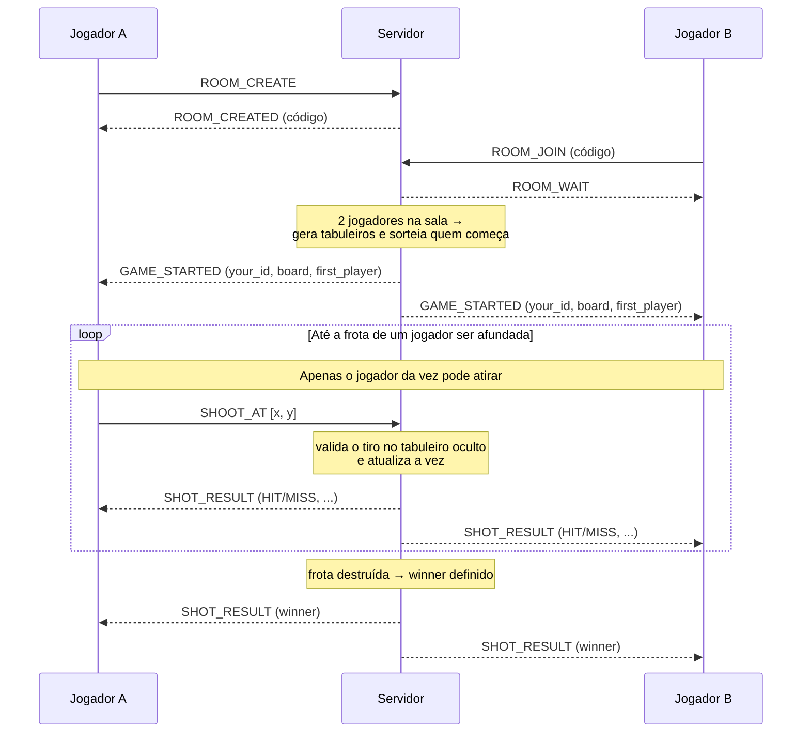

# Batalha Naval — Trabalho de Redes I

Aplicação distribuída no modelo **cliente-servidor** desenvolvida para o
segundo crédito da disciplina **Redes I**.

- **Equipe:** Yohanan Santana, Stella Ribas, Gabriel Galdino, Izabelle Garcez
- **Professor:** Jorge Lima de Oliveira Filho
- **Transporte:** TCP

---

## Sumário

- [Batalha Naval — Trabalho de Redes I](#batalha-naval--trabalho-de-redes-i)
  - [Sumário](#sumário)
  - [1. Propósito da aplicação](#1-propósito-da-aplicação)
  - [2. Motivação da escolha do transporte (TCP)](#2-motivação-da-escolha-do-transporte-tcp)
  - [3. Arquitetura da aplicação](#3-arquitetura-da-aplicação)
    - [Diagrama de componentes](#diagrama-de-componentes)
    - [Estrutura de pastas](#estrutura-de-pastas)
  - [4. Protocolo da camada de aplicação](#4-protocolo-da-camada-de-aplicação)
    - [4.1. Formato das mensagens (enquadramento)](#41-formato-das-mensagens-enquadramento)
    - [4.2. Mensagens do cliente para o servidor](#42-mensagens-do-cliente-para-o-servidor)
    - [4.3. Mensagens do servidor para o cliente](#43-mensagens-do-servidor-para-o-cliente)
    - [4.4. Máquina de estados (sala / partida)](#44-máquina-de-estados-sala--partida)
    - [4.5. Eventos e fluxo de uma partida](#45-eventos-e-fluxo-de-uma-partida)
    - [4.6. Tratamento de erros e casos de borda](#46-tratamento-de-erros-e-casos-de-borda)
  - [5. Requisitos mínimos de funcionamento](#5-requisitos-mínimos-de-funcionamento)
  - [6. Como executar](#6-como-executar)
  - [7. Ferramentas de desenvolvimento](#7-ferramentas-de-desenvolvimento)

---

## 1. Propósito da aplicação

A aplicação consiste em um jogo de **Batalha Naval 1v1 em rede (LAN)**. A
escolha do jogo foi motivada por aproveitar a lógica de um clássico jogo de
tabuleiro para dois jogadores, no qual o objetivo é adivinhar as coordenadas
das embarcações inimigas e afundar a frota adversária por completo antes do
oponente. A esse clássico adicionamos o caráter digital e de redes, por meio
de **comunicação cliente-servidor**, **estado compartilhado** e **turnos**.

O papel do usuário é **criar uma sala** (ou **entrar em uma já existente** a
partir de um código de 6 letras) e, em turnos, **atirar** nas coordenadas do
tabuleiro inimigo até afundar toda a frota adversária.

Cada jogador possui uma frota de 5 navios distribuída aleatoriamente em um
tabuleiro de **10×10 casas**:

| Navio             | Tamanho (casas) |
|-------------------|:---------------:|
| Porta-Aviões      | 5               |
| Encouraçado       | 4               |
| Cruzador          | 3               |
| Submarino         | 3               |
| Contratorpedeiro  | 2               |

Vence quem afundar primeiro **todas as 17 casas** ocupadas por navios do
adversário.

---

## 2. Motivação da escolha do transporte (TCP)

A comunicação é feita sobre o **TCP** (*Transmission Control Protocol*), que
fornece um socket com um **fluxo de bytes confiável e ordenado**.

A Batalha Naval, sendo um jogo **baseado em turnos** com **estados bem
definidos**, necessita da garantia de entrega dos dados em ordem — algo que o
TCP fornece e que o UDP, em contraste, não garante. Se uma mensagem indicando
um tiro, por exemplo, se perdesse, o servidor e os clientes ficariam
esperando uma resposta para sempre, e o jogo travaria.

Em resumo, três grandes motivos justificam a escolha do TCP:

1. **Jogo por turnos baseado em estado:** um único pacote perdido travaria a
   partida, pois cada parte espera a resposta da outra para prosseguir.
2. **Confiabilidade e ordenação automáticas:** o TCP garante entrega, ordem e
   retransmissão dos pacotes. Usar UDP exigiria **reimplementar toda essa
   confiabilidade manualmente** (numeração de pacotes, *acks*, retransmissão,
   reordenação), reescrevendo o que o TCP já oferece pronto.
3. **Overhead irrelevante neste contexto:** o volume de mensagens é baixo
   (poucas mensagens por jogada) e a latência não é crítica em um jogo de
   turnos, então o custo extra do TCP em relação ao UDP é desprezível.

---

## 3. Arquitetura da aplicação

O modelo cliente-servidor desta aplicação é **autoritativo**: o **servidor**
é quem gera os dois tabuleiros, sorteia quem começa, **valida cada tiro** e
detecta o fim de jogo. O **cliente apenas desenha** a interface e **envia as
ações** do jogador (criar/entrar em sala e atirar). Essa escolha mantém:

- **Consistência:** existe um único estado oficial da partida (no servidor),
  evitando que os dois clientes divirjam sobre o que aconteceu.
- **Anti-trapaça:** como o cliente nunca recebe o tabuleiro do inimigo nem
  decide se um tiro acertou, não é possível adulterar o jogo pelo cliente. O
  cliente só conhece o resultado já validado de cada tiro.

Apesar de ser pensado para rodar em LAN, a lógica do jogo é **pura e testável
sem rede**: o módulo [`bnaval/server/game.py`](bnaval/server/game.py)
concentra toda a regra (geração de tabuleiros, turnos, validação de tiros e
fim de jogo) sem depender de sockets.

### Diagrama de componentes



### Estrutura de pastas

```
bnaval/
├── client/                 # interface gráfica do jogador (pygame)
│   ├── __main__.py         # laço principal do cliente; conecta e troca de telas
│   ├── interface/
│   │   ├── menu.py         # menu inicial (criar/entrar em sala)
│   │   ├── game.py         # tela de jogo, thread de recebimento de mensagens
│   │   ├── players.py      # representação visual do jogador e do inimigo
│   │   └── ui.py           # componentes de interface (botões, textos)
│   ├── input.py            # gerenciamento de teclado e mouse
│   ├── res.py              # carregamento de assets (sprites, fontes, sons)
│   ├── utils/__init__.py   # ClientConn (conexão com o servidor), cores, helpers
│   └── assets/             # imagens, fonte e efeitos sonoros
│
├── server/                 # servidor autoritativo
│   ├── __main__.py         # salas, aceitação de conexões e laço da partida
│   └── game.py             # GameState: tabuleiros, turnos e validação de tiros
│
└── common/                 # código compartilhado entre cliente e servidor
    ├── network.py          # Conn / MultiConn: enquadramento (8 bytes + JSON)
    ├── logic.py            # PlayerBoard, Cell, ShipType, ShotState
    ├── config.py           # endereço, porta, nº de jogadores, tamanho do tabuleiro
    └── __init__.py         # tipos JSON e validadores (AssertVal)
```

---

## 4. Protocolo da camada de aplicação

Esta seção descreve o protocolo de aplicação criado para o jogo, cobrindo os
três pilares: **formato das mensagens**, **estados** e **eventos**.

### 4.1. Formato das mensagens (enquadramento)

O TCP entrega um **fluxo contínuo de bytes**, sem fronteiras entre mensagens.
Isso significa que, sozinho, ele não diz onde uma mensagem termina e a outra
começa. Vários envios podem chegar grudados, ou uma mensagem pode chegar
partida em pedaços. Para resolver isso, definimos um **enquadramento
(*framing*)** próprio:

```
┌────────────────────────┬─────────────────────────────────┐
│  TAMANHO (8 bytes)     │  CONTEÚDO (JSON em UTF-8)       │
│  inteiro big-endian    │  { "type": "...", ... }         │
└────────────────────────┴─────────────────────────────────┘
```

Cada mensagem é composta por:

1. Um **cabeçalho de 8 bytes** (inteiro *big-endian*) indicando o **tamanho,
   em bytes, do conteúdo** que vem a seguir.
2. O **conteúdo**: uma string **JSON** em UTF-8.

O receptor sempre lê **exatamente 8 bytes** para descobrir o tamanho `N` e,
em seguida, lê **exatamente `N` bytes** para obter a mensagem completa. É esse
cabeçalho de tamanho que permite reconstruir mensagens individuais a partir do
fluxo de bytes do TCP.

Todo conteúdo JSON é um objeto com um campo **`"type"`** que identifica a
mensagem. Os demais campos **variam conforme o tipo** da mensagem. Exemplo:

```json
{ "type": "SHOOT_AT", "position": [3, 7] }
```

> Implementação do enquadramento: classe `Conn` em
> [`bnaval/common/network.py`](bnaval/common/network.py).

### 4.2. Mensagens do cliente para o servidor

| `type`        | Campos               | Significado                                       |
|---------------|----------------------|---------------------------------------------------|
| `ROOM_CREATE` | —                    | Cria uma nova sala.                               |
| `ROOM_JOIN`   | `data`: `"abcdef"`   | Entra em uma sala pelo código (6 letras).         |
| `SHOOT_AT`    | `position`: `[x, y]` | Dispara um tiro na coordenada (0 a 9) do inimigo. |

### 4.3. Mensagens do servidor para o cliente

| `type`         | Campos                                                             | Quando é enviada                                    |
|----------------|-------------------------------------------------------------------|-----------------------------------------------------|
| `ROOM_CREATED` | `data`: `"abcdef"`                                                 | Resposta ao `ROOM_CREATE`: código da sala criada.   |
| `ROOM_WAIT`    | —                                                                 | Entrou na sala; aguarde o início da partida.        |
| `ROOM_INVALID` | —                                                                 | O código informado não corresponde a sala alguma.   |
| `ROOM_FULL`    | —                                                                 | A sala já está cheia (2 jogadores).                 |
| `GAME_STARTED` | `your_id`, `your_board`, `first_player`                           | A partida começou (enviada aos dois jogadores).     |
| `SHOT_RESULT`  | `result`, `pos`, `who_shot`, `sunk_ship`, `winner`, `next_player` | Resultado de um tiro.                               |
| `DISCONNECTED` | —                                                                 | O oponente perdeu a conexão; a partida é encerrada. |

**Detalhamento dos payloads mais complexos:**

- **`GAME_STARTED`**
  - `your_id` (int): identificador do jogador nesta partida (`0` ou `1`).
  - `your_board` (objeto): o **tabuleiro do próprio jogador**, no formato
    `{ "width": 10, "height": 10, "cells": [ { "ship": "Cruzador" | null }, ... ] }`
    (lista de casas em ordem *row-first*).
  - `first_player` (int): o `id` de quem começa jogando.

- **`SHOT_RESULT`**
  - `result` (string): `"HIT"` (acertou navio), `"MISS"` (água) ou
    `"INVALID"` (tiro recusado — ver §4.6).
  - `pos` (`[x, y]`): a casa atingida.
  - `who_shot` (int): o `id` de quem disparou.
  - `sunk_ship` (string \| null): o nome do navio, caso este tiro o tenha
    **afundado** por completo; senão `null`.
  - `winner` (int \| null): o `id` do vencedor, caso este tiro tenha
    **encerrado o jogo**; senão `null`.
  - `next_player` (int): o `id` de quem joga em seguida.

### 4.4. Máquina de estados (sala / partida)

Cada sala no servidor passa pelos seguintes estados:



| Estado                 | Descrição                                                                |
|------------------------|--------------------------------------------------------------------------|
| `AGUARDANDO_JOGADORES` | A sala foi criada e tem 1 jogador, esperando o segundo entrar.           |
| `EM_JOGO`              | Há 2 jogadores; o servidor já gerou os tabuleiros e a partida acontece.  |
| `FIM_DE_JOGO`          | Uma frota foi destruída (há vencedor) ou um jogador desconectou.         |

### 4.5. Eventos e fluxo de uma partida

Sequência completa de mensagens entre o Jogador A (cria a sala), o Servidor e
o Jogador B (entra na sala):



Passo a passo:

1. O Jogador A envia `ROOM_CREATE`; o servidor cria a sala e responde
   `ROOM_CREATED` com o código.
2. O Jogador B envia `ROOM_JOIN` com o código e recebe `ROOM_WAIT`.
3. Com **2 jogadores** na sala, o servidor **gera os dois tabuleiros**,
   **sorteia quem começa** e envia `GAME_STARTED` para ambos.
4. O jogador da vez envia `SHOOT_AT [x, y]`.
5. O servidor **valida o tiro no tabuleiro oculto** do adversário (água /
   navio / afundou), **troca a vez** e envia o `SHOT_RESULT` para os **dois**
   jogadores (assim ambos atualizam suas telas).
6. Quando uma frota é totalmente destruída, o servidor define o `winner` no
   `SHOT_RESULT` e a partida termina.

### 4.6. Tratamento de erros e casos de borda

O protocolo prevê os seguintes casos especiais, o que torna a comunicação
robusta:

| Situação                              | Tratamento                                                                                   |
|---------------------------------------|----------------------------------------------------------------------------------------------|
| Tiro fora do turno do jogador         | `SHOT_RESULT` com `result = "INVALID"`, enviado **apenas ao atirador**; a vez **não** muda.  |
| Tiro fora dos limites do tabuleiro    | `result = "INVALID"`; a vez **não** muda.                                                     |
| Tiro em uma casa já atingida          | `result = "INVALID"`; a vez **não** muda.                                                     |
| Entrar em sala inexistente            | Servidor responde `ROOM_INVALID`.                                                             |
| Entrar em sala cheia                  | Servidor responde `ROOM_FULL`.                                                               |
| Queda de conexão de um jogador        | Servidor envia `DISCONNECTED` ao outro jogador e encerra a partida.                           |

> A geração dos tabuleiros, o sorteio do turno, a validação dos tiros e a
> detecção de fim de jogo ficam em
> [`bnaval/server/game.py`](bnaval/server/game.py) (lógica pura). As salas e o
> repasse das mensagens ficam em
> [`bnaval/server/__main__.py`](bnaval/server/__main__.py).

---

## 5. Requisitos mínimos de funcionamento

- **Python ≥ 3.10** (definido em [`pyproject.toml`](pyproject.toml)).
- **Dependência:** `pygame` (instalada automaticamente — ver §6).
- **Sistema operacional:** Windows ou Linux.
- **2 jogadores** (a partida é exatamente 1v1).
- **Rede TCP acessível** entre as máquinas. Por padrão, o jogo está
  configurado para `127.0.0.1` (mesma máquina), na **porta `7200`**.
  - Para jogar em **LAN entre máquinas diferentes**, basta ajustar
    `SERVER_ADDR` em [`bnaval/common/config.py`](bnaval/common/config.py) para o endereço IP do
    servidor na rede local.

O arquivo [`run.py`](run.py) cuida de tudo automaticamente: cria um ambiente
virtual (`venv`) isolado e instala as dependências na primeira execução.

---

## 6. Como executar

> A partida é 1v1, então são necessários **um servidor e dois clientes** (cada
> um em seu próprio terminal). **O servidor deve ser iniciado primeiro.**

**1) Inicie o servidor** (terminal 1) e deixe-o aberto:

```sh
python run.py server
```

Aguarde a mensagem `Rodando servidor em 127.0.0.1:7200`. Esse terminal fica
"parado" de propósito, aguardando conexões.

**2) Abra o primeiro cliente** (terminal 2) e **crie uma sala**, anotando o
código de 6 letras exibido:

```sh
python run.py client
```

**3) Abra o segundo cliente** (terminal 3) e **entre na sala** usando o
código:

```sh
python run.py client
```

A partida começa assim que o segundo jogador entra.

> Ao terminar, feche o servidor com `Ctrl+C`. Se ele continuar
> rodando, a porta `7200` permanece ocupada e a próxima execução do servidor
> falhará com um erro de "endereço já em uso".

Caso alguma dependência fique faltando, é possível forçar a instalação:

```sh
python run.py setup
```

---

## 7. Ferramentas de desenvolvimento

```sh
python run.py format   # formatação de código (black)
python run.py check    # checagem estática de tipos (mypy)
python run.py doc      # geração de documentação da API (pdoc)
```

